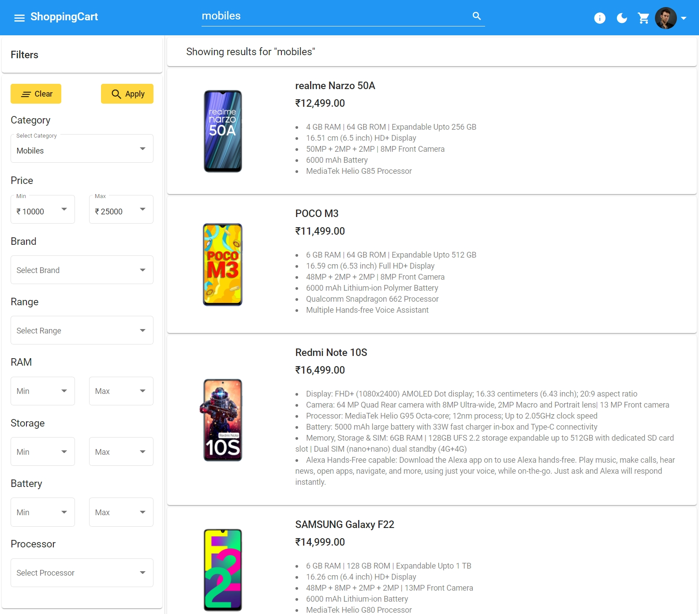
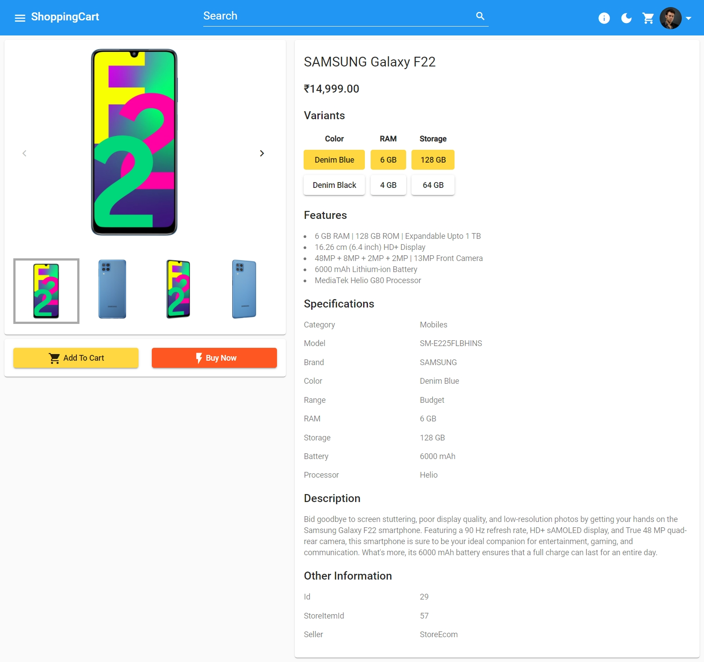
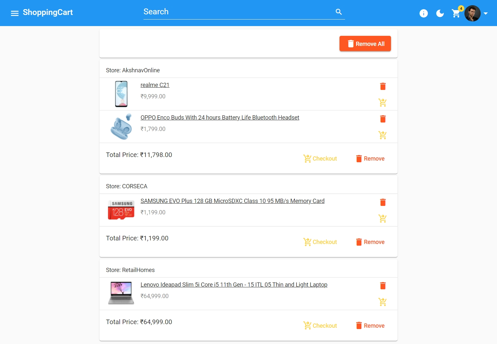
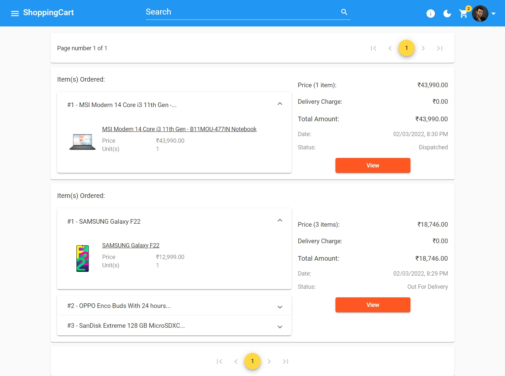
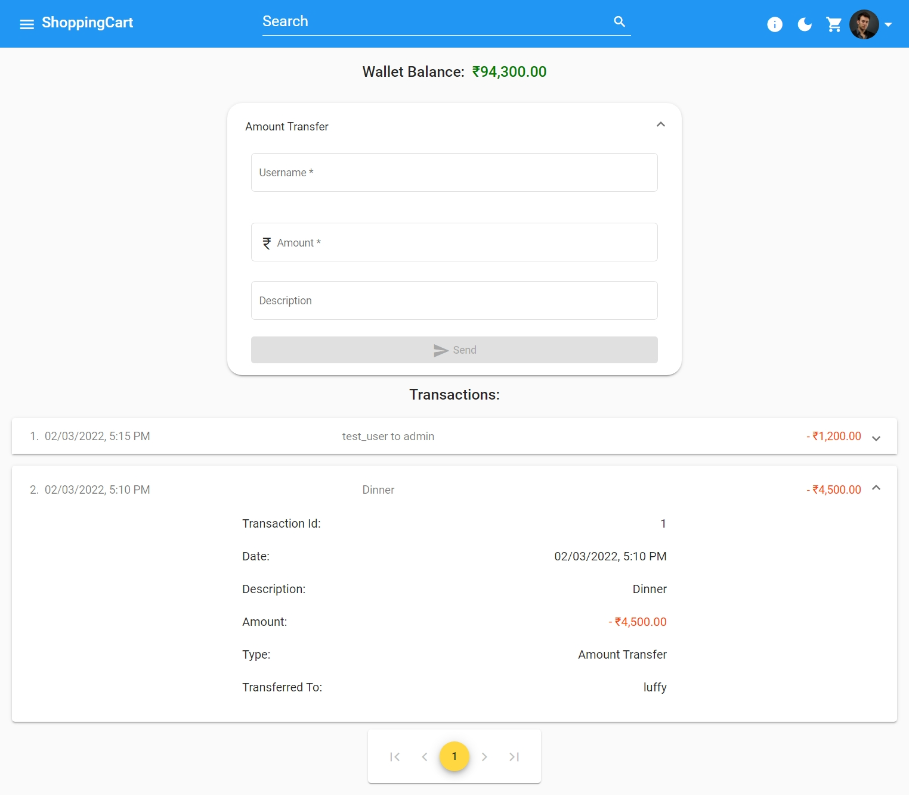
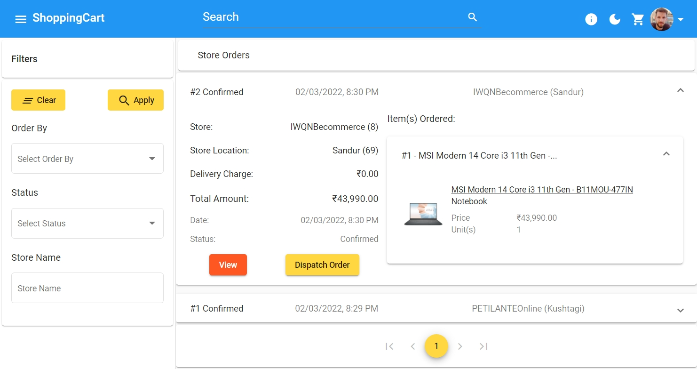
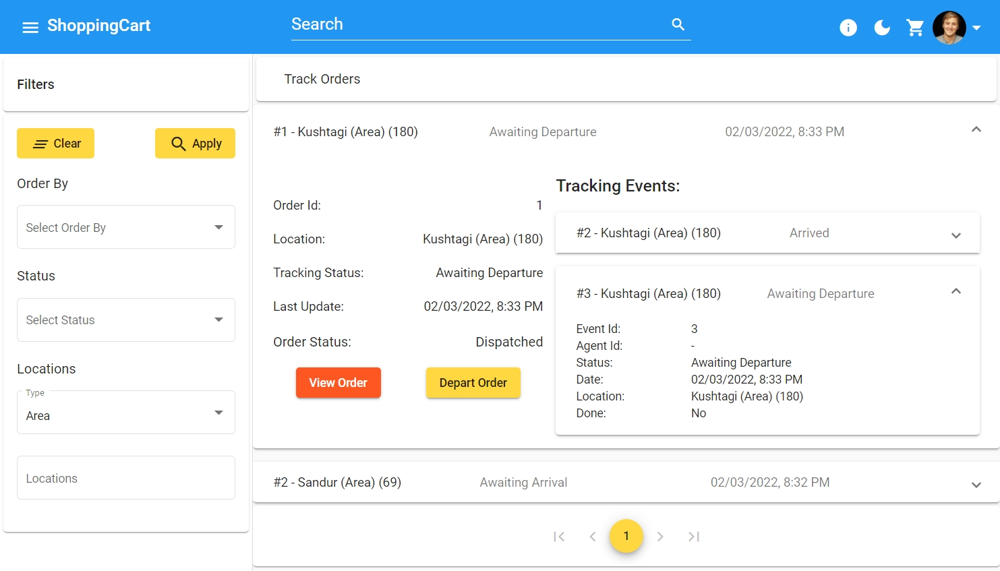
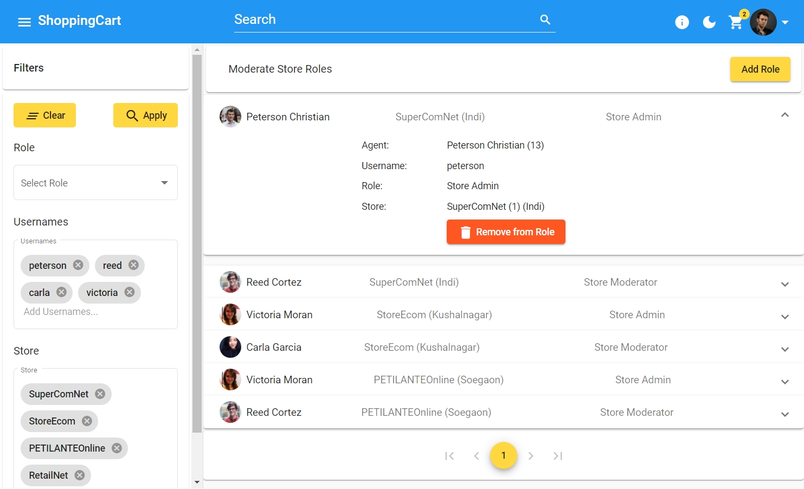
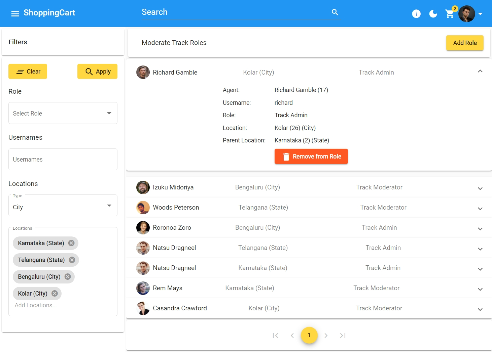

<!-- PROJECT LOGO -->
<h1 align="center">ShoppingCart</h1>

<!-- TABLE OF CONTENTS -->

<details>
    <summary>Table of Contents</summary>
    <ol>
        <li>
            <a href="#about-the-project">About The Project</a>
        </li>
        <li>
            <a href="#app-features">Features</a>
            <ul>
                <li><a href="#home">Home</a></li>
                <li><a href="#product-search-and-filter">Product Search and Filter</a></li>
                <li><a href="#product-information">Product Information</a></li>
                <li><a href="#cart">Cart</a></li>
                <li><a href="#wallet-transactions-and-transfer">Wallet, Transactions and Transfer</a></li>
                <li><a href="#role-administration">Role Administration</a></li>
                <li><a href="#wallet-transactions-and-transfer">Themes and Responsive UI</a></li>
            </ul>
        </li>
        <li>
            <a href="#built-with">Built With</a>
        </li>
        <li><a href="#contact">Contact</a></li>
        <li><a href="#acknowledgements">Acknowledgements</a></li>
    </ol>
</details>

<!-- ABOUT THE PROJECT -->

## Demo
Clone this repository to your local machine 
```sh
git clone https://github.com/varunbr/ShoppingCart.git
```
Run below command from ShoppingCart folder to create image in docker
```sh
docker compose -f "docker-compose.yml" up --build
```
Launch http://localhost:5000/ to explore..!

 ***Optional:** Configure CloudinarySettings in appSettings.json for photo upload functionality*


**If you like❤ my project, Support me by giving Star⭐**


## About The Project


<p align="center">
    ShoppingCart is an e-commerce web app where users can view, order any available product.
    <br />
</p>

## App Features

### Home
- The Home page is designed to help users find the products they need with ease.
- It showcases the most popular products in different categories, such as Mobiles, Televisions, Laptops, Refrigerators, and Washing Machines. 
- Users can tap on any category to see more products or use the first row on the Home page to select a different category.

### Product Search and Filter
- The app allows users to search for products from any page using the search box in the navbar. 
- The app automatically detects the category of the product based on the search keyword and displays relevant results. 
- Users can also manually select a category from the filter section to narrow down their search. 
- The filter section also provides various options to refine the search results, such as setting the range for numerical values like RAM, Storage, Price, etc., or selecting multiple values like Brand, Color, etc.
[](http://localhost:5000/search?q=Mobiles)

### Product Information
- The app provides detailed information about each product, including photos, features, descriptions, and specifications. 
- Users can swipe through the photos in a gallery to see more details. 
- Users can also switch between different variants of the product, such as Color, Storage, etc., by tapping on the icons below the photos. 
- Users can either buy the product directly or add it to their cart for later purchase.
[](http://localhost:5000/product/33)

### Cart
- The app organizes the products in the cart by the store they are purchased from, which helps users save on delivery charges by buying multiple items from the same store. 
- Users can remove any product from the cart or clear the entire cart by tapping on the trash icon. 
- Users can also check out individual items or all items from a store by tapping on the buy button.
[](http://localhost:5000/cart)

### Order
- The app enables users to order single or multiple items from a store with a few taps. 
- Users can view their order details, such as item info, number of units, order status, total price, delivery charges, and total amount paid. 
- Users can also track their orders by tapping on the order status icon. 
- Users can view their previous orders in a paginated list sorted by date in descending order. 
- The app charges ₹60 for interstate delivery and ₹40 for intrastate delivery. 
- The delivery charge is waived if the total price is more than ₹500.
[](http://localhost:5000/order)

### Wallet, Transactions and Transfer
- All the registered users will have an initial wallet balance of ₹1,00,000.
- Users can view the paginated transaction list in the descending order of date.
- Users can view transaction date, description, amount, type of transaction, etc.
- Users can transfer amount to other users using their username.
[](http://localhost:5000/wallet)

### User Authentication
- User need to sign in to access some features of the app, such as adding items to your cart, placing orders, or editing your profile. 
- User can sign in with your username and password or create a new account. 
- User session will expire after 24 hours of inactivity.

### Role Administration
Roles in ShoppingCart App includes User, Store Agent, Track Agent, Store Admin, Track Admin,Store Moderator, Track Moderator & Super Admin.

**Logins:** *Default passwords for all users is 'AdminUser@2022'*
|   # |                            Role                            | UserName |
| --: | :-------------------------------------------------------------: | :------ |
|   1 |User|kim |
|   2 |Store Agent|natsu|
|   3 |Store Admin|luffy|
|   4 |Track Agent|rem|
|   5 |Track Admin|zoro|
|   6 |Store Moderator|test_user|
|   7 |Track Moderator|test_user|
|   8 |Super Admin|admin|

#### User
This is the default role for all signed-in users. You can browse products, add them to your cart, place orders, and transfer money.

#### Store Agent
This role is assigned to users who work in a store. You can dispatch orders from your store to the customers or to the next location.
[](http://localhost:5000/store/order)

#### Track Agent
This role is assigned to users who work in a location. You can receive or dispatch orders from your location to the next destination or to the customers.
[](http://localhost:5000/track)

#### Store Admin
This role is assigned to users who manage a store. You can do everything that a Store Agent can do, plus you can view, add, or remove Store Agent or Store Admin roles for your store.

#### Track Admin 
This role is assigned to users who manage a location. You can do everything that a Track Agent can do, plus you can view, add, or remove Track Agent or Track Admin roles for your location.

#### Store Moderator
This role is assigned to users who oversee all the stores. You can view, add, or remove Store Agent and Store Admin roles for any store.
[](http://localhost:5000/admin/moderate/store-role)

#### Track Moderator
This role is assigned to users who oversee all the locations. You can view, add, or remove Track Agent and Track Admin roles for any location.
[](http://localhost:5000/admin/moderate/track-role)

#### Super Admin
This role is assigned to users who have full control over the app. You can view, add, or remove Store Moderator and Track Moderator roles.

### Themes and Responsive UI
- Users can customize the appearance of the web app by choosing between Light and Dark themes. The theme button is located in the navbar and can be toggled at any time. 
- The web app is also designed to work on any device, whether it is a mobile phone, a tablet, a laptop or a desktop computer.

## Built With

<p align="center">
    <a href="https://dotnet.microsoft.com/apps/aspnet/">
        
    </a>
    <a href="https://angular.io/">
        
    </a>
    <a href="https://material.angular.io/">
        
    </a>
</p>

|   # |                            Framework                            | Version |
| --: | :-------------------------------------------------------------: | :------ |
|   1 |     _ASP.NET_ [](https://dotnet.microsoft.com/apps/aspnet/)     | 7.0     |
|   2 |                _Angular_ [](https://angular.io/)                | 15.0    |
|   3 | _Angular Material_ [](https://material.angular.io/)             | 14.0     |

## Contact

<a href="https://varunbr.github.io">Contact</a>

## Acknowledgements

- [Cloudinary - Image Repository](https://cloudinary.com/)
- [GitHub Pages - Web Hosting(Frontend)](https://pages.github.com/)
- [Flipkart - Data & Image Urls](https://www.flipkart.com/)
- [Amazon - Data & Image Urls](https://www.amazon.in/)
- [Angular Flex-Layout](https://github.com/angular/flex-layout)
