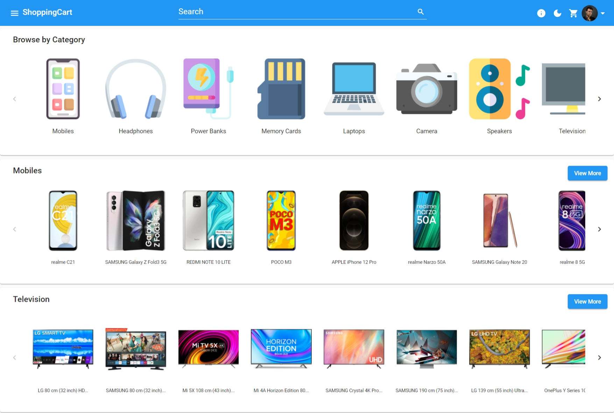

<!-- PROJECT LOGO -->
<h1 align="center">ShoppingCart</h1>

<!-- TABLE OF CONTENTS -->

    
Table of Contents

    <ol>
        <li>
            <a href="#about-the-project">About The Project</a>
        </li>
        <li>
            <a href="#app-features">Features</a>
            <ul>
                <li><a href="#home">Home</a></li>
                <li><a href="#product-search-and-filter">Product Search and Filter</a></li>
                <li><a href="#product-information">Product Information</a></li>
                <li><a href="#cart">Cart</a></li>
                <li><a href="#wallet-transactions-and-transfer">Wallet, Transactions and Transfer</a></li>
                <li><a href="#role-administration">Role Administration</a></li>
                <li><a href="#wallet-transactions-and-transfer">Themes and Responsive UI</a></li>
            </ul>
        </li>
        <li>
            <a href="#built-with">Built With</a>
        </li>
        <li><a href="#contact">Contact</a></li>
        <li><a href="#acknowledgements">Acknowledgements</a></li>
    </ol>

<!-- ABOUT THE PROJECT -->

## About The Project

    ShoppingCart is an e-commerce web app where users can view, order any available product.
     
    <a href="https://varunbr.github.io/ShoppingCart/">View Demo</a>

## App Features

### Home
- Home page lets user to quickly navigate to popular products.
- The first row on the home page lets users quickly select product categories.
- The next rows include products of Mobiles, Televisions, Laptops, Refrigerators and Washing Machines Categories.
- Each of these categories lists popular products of that category.
- This page will be cached in-memory for later usage.

### Product Search and Filter
- The search box in the navbar will allow users to search from any page.
- The category will be selected automatically based on the search keyword. If not detected automatically, products from all the categories will be searched.
- Users can also select categories from the filter section.
- If the category is selected, filters specific to that category will be shown dynamically.
- Users can select the range for integer values like RAM, Storage, Price, etc., select multiple values like Brand, Color, etc.

### Product Information
- Users can view photos of products in a gallery.
- Users can view Features, Descriptions and Specifications specific to each product.
- Users can quickly choose different variants of products like Color, Storage, etc.
- Users can proceed to buy or add to the cart for future purchases.

### Cart
- Products added to carts are grouped by purchase store which can be purchased together and reduce the delivery price.
- Users can remove any or all products from the cart.
- Users can checkout single or all grouped items for purchase.

### Order
- Users can order single or multiple items of same-store together.
- Users can view order details which include Item info, Number of units, Order status, Total Price Delivery charges and Total Amount paid.
- Users can view the paginated order list in the descending order of date.
- Delivery charge will be ₹60 for interstate and ₹40 for intrastate.
- Delivery charge will be applied only if Total Price is less than ₹500.

### Wallet, Transactions and Transfer
- All the registered users will have an initial wallet balance of ₹1,00,000.
- Users can view the paginated transaction list in the descending order of date.
- Users can view transaction date, description, amount, type of transaction, etc.
- Users can transfer amount to other users using their username.

### User Authentication
- Users need to authenticate to perform a few actions like add to cart, order, edit profile, etc.
- Users can log in using a username and password or register as new users to authenticate.
- Authentication will expire in 24 hours after login.

### Role Administration
Roles in ShoppingCart App includes User, Store Agent, Track Agent, Store Admin, Track Admin,Store Moderator, Track Moderator & Admin.

#### User
All loged in users will be in this role.

#### Store Agent
Each Store can have many Store Agents, Store Agents can Dispatch orders from stores.

#### Track Agent
Each Location can have many Track Agents, Store Agents can Receive or Dispatch order from that location

#### Store Admin
Each Store can have many Store Admins, Store Admins can Dispatch orders from stores & View, Add & Remove Store Agent or Store Admin roles of that store.

#### Track Admin 
Each Location can have many Track Admins, Store Admins can Receive or Dispatch order, also View, Add & Remove Track Agent or Track Admin roles of that location.

#### Store Moderator
Store Moderator can View, Add & Remove Store Agent & Store Admin roles of any store.

#### Track Moderator
Track Moderator can View, Add & Remove Track Agent & Track Admin roles of any location.

#### Admin
Admin can View, Add & Remove Store Moderator & Track Moderator

### Themes and Responsive UI
- Users can swtich between Light and Dark theme using theme button in navbar.
- Users can use this responsive Web app across any Mobile, Tablet, Laptop, or Desktop.

## Built With

    
    
    

|   # |                            Framework                            | Version |
| --: | :-------------------------------------------------------------: | :------ |
|   1 |     _ASP.NET_      | 6.0     |
|   2 |                _Angular_                 | 13.0    |
|   3 | _Angular Material_              | 13.0     |

## Contact

<a href="https://varunbr.github.io">Contact</a>

## Acknowledgements

- [Cloudinary - Image Repository](https://cloudinary.com/)
- [Heroku - Cloud Application Platform(Backend)](https://www.heroku.com/)
- [GitHub Pages - Web Hosting(Frontend)](https://pages.github.com/)
- [Flipkart - Data & Image Urls](https://www.flipkart.com/)
- [Amazon - Data & Image Urls](https://www.amazon.in/)
- [Angular Flex-Layout](https://github.com/angular/flex-layout)
